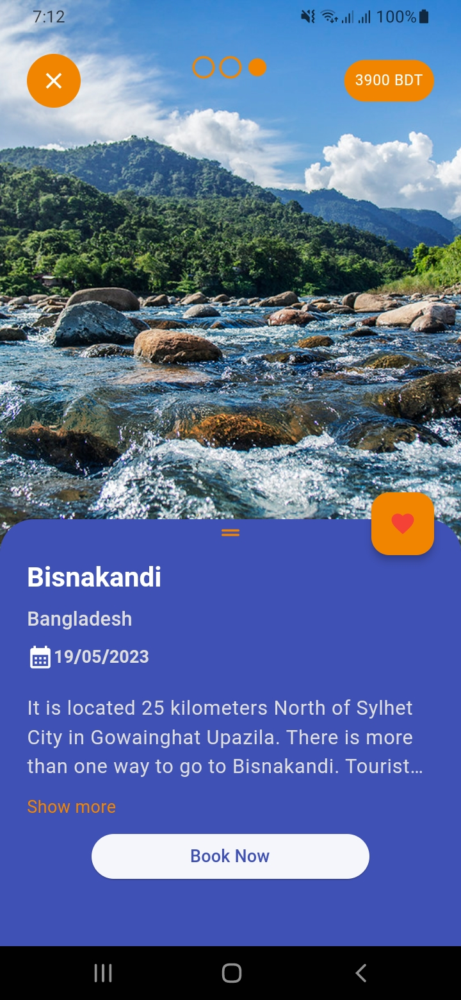
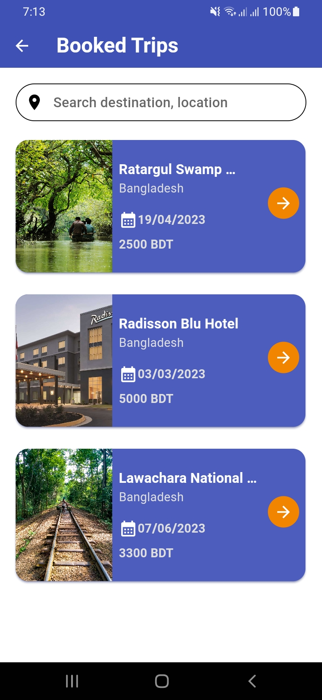

# triffy

## Flutter - A simple project for Trip management.

## Development Setup

Clone the repository and run the following commands:

```
flutter pub get
flutter run
```

## Dependencies

```
flutter_native_splash
get
flutter_svg
get_storage
firebase_core
firebase_auth
flutter_slider_indicator
cloud_firestore
```

## Features

* Login - Firebase
* Registration - Firebase (email, password)
* Home - Place list
* Details - Place details
* Booked Trips - Booked trip list

## Screenshots

| Splash                                                     | Welcome                                                      |
|------------------------------------------------------------|--------------------------------------------------------------|
|  |   |

| Login                                                     | Registration                                                     |
|-----------------------------------------------------------|------------------------------------------------------------------|
|  |  |

| Home                                                     | Details                                                     |
|----------------------------------------------------------|-------------------------------------------------------------|
|  |  |

| Booked                                                     | 
|------------------------------------------------------------|
|  |

## Links

* [Web App Link](https://triffy-1cc5e.web.app/)

## Important

* Database managed with Firebase Firestore
* Web App deployed with github workflows in Firebase hosting